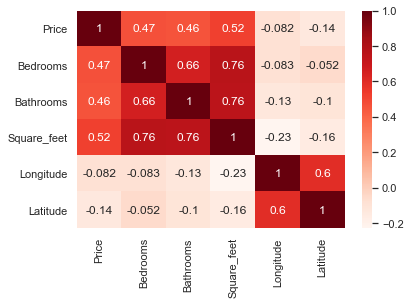
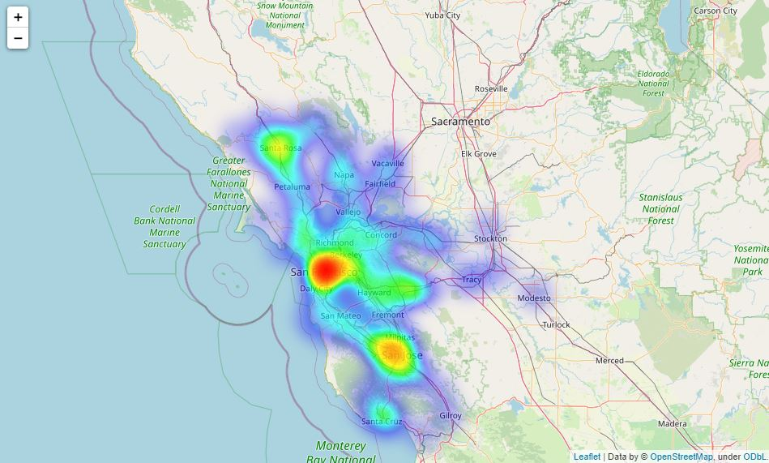
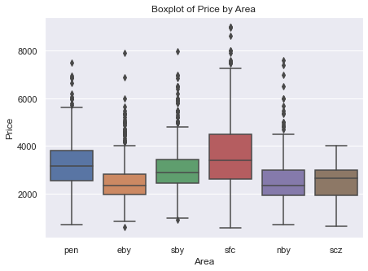
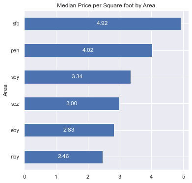
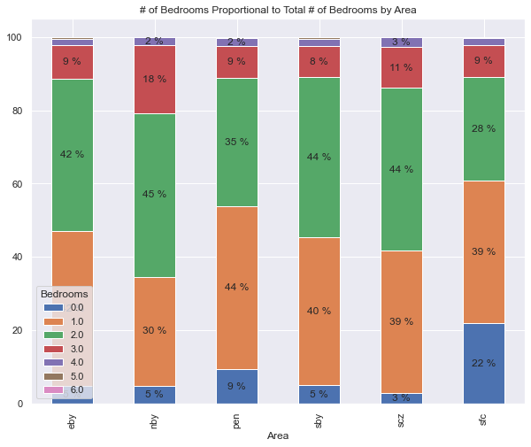

# Bay Area Apartment Pricing - Exploratory Analysis

## Table of Contents
- [Background](#Background)
  - [Datacleaning](#datacleaning)
- [Findings](#Findings)
- [Usage](#Usage)

<a name="Background"/>

## Background
In this project I collected data by webscraping Craigslist using Python & BeautifulSoup package. The data was collected on March 2020 and contains information for postings from 3 months prior. The goal of this project was to analyze the apartment postings to find which locations in the the Bay Area were the more beneficial to live in based on multiple variables. I'm originally from the Peninsula area so I wanted to know more about the other areas.

<a name="datacleaning"/>

### Data Cleaning
-----------------------
Right after the data was scraped it was organized and simple data cleaning was performed such as stripping unneeded characters in each column and making each column the correct datatype. Besides that after the dataframe was ready there was some more data cleaning that had to be performed to be able to explore the data accurately such as:
1. Removing identical post since craiglist usually has spammed postings.
2. Identifying outliers that would skew the data horrendously. For example there was apartments with the cost of $68 or up to $45000 for a 5bd home. This doesn't represent our data well so I just decided to omit these posts.

<a name="Findings"/>

## Findings

Finding the correlations between our continous variables I found that square feet had the highest relationship between the price of an apartment. Square feet also had a high relationship with the number of bedrooms and bathrooms, but that was expected since the more bathrooms & bedrooms the higher the square footage.

The map above gives a general sense of what areas are more expensive by using a heatmap to show the magnitue of prices.

The boxplot above and the heatmap both show that San Francisco City (SFC), Peninsula (PEN), and South Bay (SBY) have the highest prices of apartments in our craigslist postings. This makes alot of sense, but what is more interesting is the North Bay & East Bay are the cheapest on average. 

The numbers above show the median square foot cost for each location and we can see that the cheapest locations cost almost half as much as the most expensive locations. 

Not only is the Northbay more cheaper by square feet, but it also has the highest proportion of 2 or more bedroom apartments. This means that a family that would have no trouble finding a low-cost apartment that is spacious in the Northbay. Opposed to San Francisco that has a high rate of studios and 1 bedroom apartments at a high cost.

I also checked if any of the categorical variables that I collected such as smoking availibility and dog/cat policy affected price, but they did not show any significant price difference. This may also have been because of how the data was collected so I restrained myself from sharing about it.
<a name="Usage"/>

## Usage
